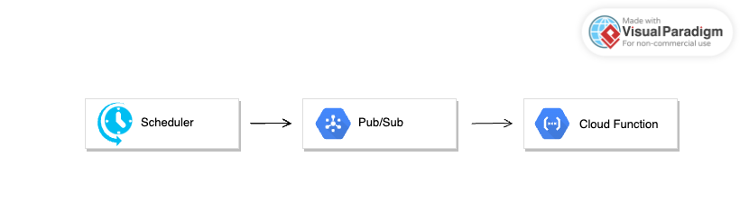

# Notion Automation

Automate your daily diary checks on Notion and receive updates via a Telegram bot. This project is developed in Python and deployed on Google Cloud Functions, triggered by Cloud Scheduler with Pub/Sub as a broker.
  
<!-- TOC -->

- [Notion Automation](#notion-automation)
  - [Project Structure](#project-structure)
  - [Cloud Infrastructure](#cloud-infrastructure)
  - [Installation](#installation)
    - [Install Required Packages](#install-required-packages)
    - [Environment Variables](#environment-variables)
    - [Run Function Locally](#run-function-locally)
    - [Deploy on Google Cloud](#deploy-on-google-cloud)

<!-- /TOC -->

## Project Structure

The main entry point is [`main.py`](main.py), which calls the `diary_check()` function in [`src/check_diary_status.py`](src/check_diary_status.py). If the diary isn't filled, a reminder is sent via `send_message()` in [`src/telegram_bot.py`](src/telegram_bot.py).

- **main.py**: Functions Framework entry point  
- **src/check_diary_status.py**: Fetches and checks today's diary entry in Notion  
- **src/telegram_bot.py**: Sends Telegram notifications  
- **telegram_group_id.py**: Prints the Telegram chat ID  
- **env.yaml**: Environment variables for the application  
- **requirements.txt**: Python dependencies

## Cloud Infrastructure

In the cloud infrastructure, use event-based Google Cloud Functions triggered by Cloud Scheduler, with Pub/Sub serving as the event broker.



## Installation

### Install Required Packages

```bash
pip install -r requirements.txt
```

### Environment Variables

Add the following variables to your `env.yaml`:

- `NOTION_API_TOKEN`  
- `DATABASE_ID`  
- `TELEGRAM_BOT_TOKEN`  
- `TELEGRAM_CHAT_ID`

### Run Function Locally

```shell
functions-framework --target=main
```

### Deploy on Google Cloud

```shell
# Create a Pub/Sub topic
gcloud pubsub topics create notion-notify

# Deploy the function
gcloud functions deploy notion-automation \
  --gen2 \
  --runtime=python312 \
  --region=asia-east1 \
  --source="." \
  --entry-point=main \
  --trigger-topic=notion-notify \
  --env-vars-file="env.yaml"

# Create a Cloud Scheduler job
gcloud scheduler jobs create pubsub notion-notify \
  --topic=notion-notify \
  --schedule="* 22 * * *" \  # Run every day at 10 PM
  --message-body="." \
  --location="asia-east1"
```
